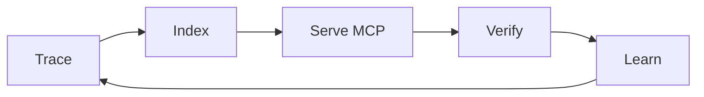

<div align="center">

<picture>
  <source media="(prefers-color-scheme: dark)" srcset="https://images.vinv.ai/vinv-banner-dark.svg">
  <source media="(prefers-color-scheme: light)" srcset="https://images.vinv.ai/vinv-banner-light.svg">
  
</picture>

<br><br>

**Vinv watches your code actually run and hands that evidence to your coding agent — then independently checks the agent's "done".**

<sub><b>Your agent says it's done. Vinv says prove it.</b></sub>

<br><br>

[](LICENSE)
[](https://open-vsx.org/extension/VinvAI/VinvAI)
[](https://open-vsx.org/extension/VinvAI/VinvAI)
[](#-privacy)

**Install:** [**Open VSX** (Cursor · VS Code · Windsurf)](https://open-vsx.org/extension/VinvAI/VinvAI) · [**vinv.ai/#install**](https://vinv.ai/#install) — or build everything from source:

</div>

```bash
git clone https://github.com/VinvAI/VinvAI ~/.vinv/engines && cd ~/.vinv/engines && ./install.sh
```

<div align="center">

<br><sub>The whole loop on Vinv's own repo: install → discover → trace → catch a real bug → dispatch → verified fix, zero clicks.</sub>
</div>

## 😤 The problem

You've lived the search query *"claude code says done but tests fail"*: the agent edits the wrong handler, invents return shapes, then grades its own homework while the server won't even start. It has never watched your code run, so it argues from static text and vibes. Vinv is the vibe coding safety net — it records a real run, ties every request to the exact line that served it, and refuses to accept "done" without proof.

## 👁 What Vinv does

Give your coding agent runtime context — five engines, one loop:

- **Semantic code search** — ask by meaning, get ranked symbols with `def` bodies and line numbers, embedded by a local model (no cloud keys).<br>
- **Code Graph** — a persistent map of every symbol and call edge, updated incrementally on save, with a live runtime overlay.<br>
- **Runtime tracing** — zero-edit runtime tracing for AI coding agents: timing, memory, args, returns, errors — per call, joined to source.<br>
- **Rank suspects** — on any failure, symbols ranked by fault-localization score over real pass/fail requests, error messages attached.<br>
- **Verified fixes** — verify AI-generated code actually works: replayed start, live port, acceptance tests the agent never sees. One click reverts everything an episode touched.<br>

> **Honest scope:** Python backends first — other stacks get the index, graph, and QnA, but no runtime evidence yet (TS & Go next).

## 🧪 We ran it on a repo you know

Not our repo — yours. We pointed Vinv at [**fastapi/full-stack-fastapi-template**](https://github.com/fastapi/full-stack-fastapi-template) (35k★), all-local on an M-series MacBook:

- **Indexed 855 symbols across 151 files with 516 call edges in 27.6s** — cold, from clone.
- **Semantic search: 5/6 natural questions hit the right symbol in the top 5, p50 64ms:**

| You ask | Vinv answers |
|---|---|
| "where are JWT access tokens created" | `create_access_token` |
| "password hashing" | `verify_password` |
| "database session dependency" | `get_db` |

- The backend then ran under Vinv's **zero-edit tracer** inside Cursor desktop, extension live — no code changes to the template.

<div align="center">

</div>

*The actual run, captured frame by frame: install → 855-symbol graph → search hits → trace hotspots → the failing frame named → verified.*

**Then we ran its backend under Vinv's zero-edit tracer** (inside Cursor desktop, DB deliberately down) and hit it with real traffic. From one run, Vinv produced:

| What Vinv saw | Result |
|---|---|
| Hotspots (per-symbol, from live spans) | `login_access_token` 12× · 8.1ms avg → `authenticate` → `get_user_by_email` 22× |
| Failing frame, named exactly | `crud.get_user_by_email` — 22× `sqlalchemy.exc.OperationalError` |
| Caller chain for every failure | `login_access_token → authenticate → get_user_by_email` |
| Trace | 274 events, 0 unparseable, finalized on SIGTERM |

Your agent sees "500". **Vinv hands it the exact failing function, the error type, and the chain that led there** — before it opens a single file.

*Bonus: this very demo caught a real Vinv bug (Python 3.14 broke OTel's contrib loader; the error was being swallowed). We fixed it the same day — [that's the loop working on ourselves.](#-proven-on-itself)*

## 🔌 Works with your agent

Vinv is an MCP server for Claude Code and Cursor — and every other MCP client you already use. One command (**Register Vinv MCP in Agent Tools**) writes both servers into every agent it detects:

| Agent | Fix dispatch | MCP tools |
|---|:---:|:---:|
| Claude Code | ✅ | ✅ auto |
| Cursor (CLI + chat) | ✅ | ✅ auto |
| Codex CLI | ✅ | ✅ auto |
| Gemini CLI | ✅ | ✅ manual |
| Copilot Chat (VS Code) | ✅ | ✅ auto |
| Windsurf Cascade | ✅ | ✅ auto |

<details><summary><b>Where the config lands, per client — and how to verify</b></summary>

Registration is idempotent and never commits secrets. Both servers (`vinv-index`, `vinv-runtime`) launch over stdio via the editor's own runtime.

- **Claude Code** — `~/.claude.json`, project-local scope (no trust prompt). Verify: `claude mcp list` shows `vinv-index` and `vinv-runtime`.
- **Cursor** — `<repo>/.cursor/mcp.json`. Verify: Settings → MCP shows both servers green.
- **Codex CLI** — `~/.codex/config.toml` under `[mcp_servers.vinv-index]` / `[mcp_servers.vinv-runtime]`.
- **Copilot Chat** — native VS Code MCP provider (auto), `.vscode/mcp.json` on older builds.
- **Windsurf Cascade** — `~/.codeium/windsurf/mcp_config.json`.
- **Gemini CLI** — dispatch works out of the box; for MCP tools, add the same two stdio servers to `~/.gemini/settings.json`.

**Your agent is also Vinv's only LLM** — every analysis step routes through the coding-agent CLI you already pay for. No provider keys, no model picker.
</details>

## ⚖️ Agent without Vinv vs with Vinv

| | Agent alone | Agent + Vinv |
|---|---|---|
| Finding code | greps and guesses files | ranked symbols with line numbers, by meaning |
| "Done" | claims it, grades its own homework | replayed start, live port, unseen acceptance tests |
| Memory | forgets every session | persistent index + graph, updated on save |
| Runtime | can't see it | real traces, values, flamegraphs per call |
| Debugging | reads source, speculates | fault-ranked suspects with real error messages |
| Bad fix | you diff and pray | one-click revert of everything the episode touched |
| Cost | burns tokens re-exploring | evidence pack composed once, locally |

## 📊 Proven on itself

Vinv's release gate is Vinv — these numbers come from running the loop on this repository:

| Metric | Result |
|---|---|
| Index | 4,036 symbols |
| Search | file hit@10 **0.90** · symbol MRR 0.51 · p50 81ms |
| Crash recovery | indexer, embedder, and traced service all kill-tested mid-run |
| Self-found waste | 83% duplicate compute found → now cached |
| Config promotion | OPE-gated: **+0.173** CI [0.081, 0.317] |
| Test suite | 941 tests green |

## ⚙️ How it works



1. **Trace** — run your Python service under the bundled tracer: no SDK, no code changes.
2. **Index** — every function embedded locally into a semantic index + call graph.
3. **Serve** — two MCP servers hand the evidence to your agent.
4. **Verify** — replayed start, live port, acceptance tests generated *before* the fix.
5. **Learn** — propensity-logged decisions; retrieval updates only on off-policy-evaluation wins.

<details><summary><b>Deeper: the context graph, Auto-Pilot, and repo layout</b></summary>

Vinv indexes **the code** and generates — from your own run — **the traces**, **the logs**, and **the metrics**, then ties all four to the exact function that handled each request. The artefacts are commodities; **the join is not.** Auto-Pilot drives the whole loop unaided: discover services → set up via your agent → start under tracing → probe → fix → re-verify, until green or budget. Layout: [`extension/`](extension/) (editor UI + MCP servers), [`index/`](index/) (Rust semantic index), [`embedder/`](embedder/) (local [CodeRankEmbed](https://huggingface.co/nomic-ai/CodeRankEmbed) sidecar), [`tracelens/`](tracelens/) (zero-edit tracer), [`identification/`](identification/) (trace↔source join), [`handbook/`](handbook/) · [`bringup/`](bringup/) · [`goal/`](goal/) (discovery & episodes), [`tests/e2e/`](tests/e2e/) (planted-bug golden test). Python engines are one [uv](https://docs.astral.sh/uv/) workspace.
</details>

## 🛠 MCP tools reference

<details><summary><b>All 10 tools across both servers</b></summary>

**`vinv-index`** — the codebase and the session:

| Tool | Returns |
|---|---|
| `vinv_query` | Ranked symbols with paths + a decision id — any by-meaning search, before grep |
| `vinv_feedback` | ack — reward −1..1 after acting on results; trains retrieval |
| `vinv_session` | trajectory · status · issues · hotspots · memory_trends · cache_candidates; actions `fix` · `run_sweep` · `set_goal` · `set_budget` |

**`vinv-runtime`** — the captured runs (read-only, provenance-stamped):

| Tool | Returns |
|---|---|
| `rank_suspects` | Fault-ranked symbols over pass/fail requests, real errors attached — **first**, on any failure |
| `values_of` | Observed argument/return types, null-rates, ranges |
| `slice` | Observed caller chain from request root, values at each frame |
| `coverage_of` | What ran, how often, ok/error, timing |
| `callers_of` / `blast_radius` / `why_did_this_run` | Observed callers · transitive impact · entry-point paths |
</details>

## 🔒 Privacy

- **Everything on your machine** — per-repo state in `.vinv/` (auto-gitignored), per-machine in `~/.vinv/`. No account, no API keys, **no telemetry — none.**
- The only download is the embedding model (Hugging Face, once, ~500 MB); everything else builds from this repo.
- Traces store bounded **summaries**, not raw values; sensitive parameter names (`password`, `token`, `api_key`, …) are redacted, never captured.
- The only LLM Vinv talks to is the coding-agent CLI **you** configured, through its own auth.

## 🤝 Contributing & license

See [CONTRIBUTING.md](CONTRIBUTING.md) — `uv sync`, `cargo build` in `index/`, `npm install && npm run check` in `extension/`, keep `tests/e2e/planted_bug_golden/run.py` green. Good first issues are labeled. [Apache License 2.0](LICENSE) © 2026 VinvAI.

<div align="center">
<sub>If Vinv caught something your agent missed — <a href="https://open-vsx.org/extension/VinvAI/VinvAI/reviews">leave a review on Open VSX</a> and ⭐ star this repo. Python first, TS & Go next · <b>Your agent says it's done. Vinv says prove it.</b></sub>
</div>
