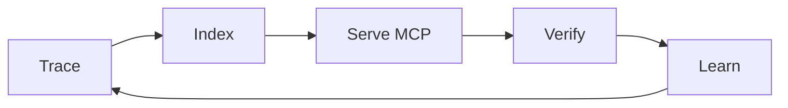

<div align="center">

<picture>
  <source media="(prefers-color-scheme: dark)" srcset="https://images.vinv.ai/vinv-banner-dark.png">
  <source media="(prefers-color-scheme: light)" srcset="https://images.vinv.ai/vinv-banner-light.png">
  
</picture>

<br><br>

**Vinv is the reinforcement loop around your coding agent. It builds the context, runs the harness, and produces the evidence** — a real run traced to the exact line that served each request, every endpoint exercised, and acceptance tests written before the fix that the agent never sees.

<sub>Judgement comes from what the code actually did, not from what the agent claims.</sub>

<br><br>

[](LICENSE)
[](https://open-vsx.org/extension/VinvAI/VinvAI)
[](https://open-vsx.org/extension/VinvAI/VinvAI)
[](https://github.com/VinvAI/VinvAI/actions/workflows/test.yml)
[](https://github.com/VinvAI/VinvAI/actions/workflows/lint.yml)
[](https://github.com/VinvAI/VinvAI/issues)
[](#privacy)

**Install:** [**Open VSX**](https://open-vsx.org/extension/VinvAI/VinvAI) · [**one-click, pick your editor**](https://vinv.ai/#install)

</div>

Or straight from your editor's CLI:

| Editor | Command |
|---|---|
| VS Code | `code --install-extension VinvAI.VinvAI` |
| Cursor | `cursor --install-extension VinvAI.VinvAI` |
| Windsurf | `windsurf --install-extension VinvAI.VinvAI` |
| VSCodium | `codium --install-extension VinvAI.VinvAI` |
| Trae | `trae --install-extension VinvAI.VinvAI` |
| VS Code Insiders | `code-insiders --install-extension VinvAI.VinvAI` |

<sub>First run builds the engines (~4 min: compiles the Rust index, fetches a one-time ~500 MB local embedding model). Needs [uv](https://docs.astral.sh/uv/) and [Rust](https://rustup.rs). First trace about a minute after that.</sub>

```bash
git clone https://github.com/VinvAI/VinvAI ~/.vinv/engines && cd ~/.vinv/engines && ./install.sh
```

<div align="center">

<br><sub>The whole loop on Vinv's own repo: install → discover → trace → catch a real bug → dispatch → verified fix, zero clicks.</sub>
</div>

## The problem

84% of developers now use or plan to use AI coding tools. More of them **actively distrust** the output (46%) than trust it (33%) — and distrust nearly doubled in a year ([Stack Overflow 2025, 49k developers](https://survey.stackoverflow.co/2025/ai/)). You know why: the agent edits the wrong handler, invents return shapes, then grades its own homework while the server won't even start.

Or it enters the **doom loop** — test fails, agent edits the same function, test fails the same way, agent edits it again, burning your context window on "let me verify." Anthropic's own research documents agents "stuck in loops, repeating the same failed approach" when they lack codebase context.

Both failures have one root cause: **the agent has never watched your code run.** It argues from static text.

## Case study: commodity models out-fix frontier ones

Vinv found **four bugs and one performance problem** in [fastapi/full-stack-fastapi-template](https://github.com/fastapi/full-stack-fastapi-template) (35k★). We handed all five to each setup — same issues, same prompts, one trial per condition, Vinv grading every run:

| Setup | Fixed |
|---|---|
| **Cheap commodity model + Vinv context** | **4 bugs + 1 optimization** |
| Frontier model, working blind | 1 bug |
| Cheap commodity model, working blind | nothing |

**This is a demonstration, not a benchmark** — five issues, one repo, one trial per condition. We're publishing it because it's checkable, not because n=5 settles anything.

The claim isn't a model ranking — blind, the commodity model scored zero. The claim is that **a model holding the failing frame, the caller chain, and the real argument values beats a stronger model guessing from static code.** The evidence is what moved, not the weights.

**Why the pass rate means something:** Vinv grades, and it doesn't take the agent's word. Acceptance tests are written before the fix and the agent never sees them. Any change that alters observable output is reverted automatically, even when it's faster: the behavior replay has to come back byte-identical, and the paired-bootstrap 95% CI on a speedup has to exclude zero.

**And the loop keeps finding real ones.** On the same pristine template, the optimization loop later surfaced — and statistically proved — a fix nobody planted: the app's default database pool (SQLAlchemy's 5+10) makes requests **queue for connection checkouts** under concurrent load, so a 7-row indexed lookup measured 22× the typical symbol's cost. Pool sized to the worker concurrency: sustained-load median **75.6ms → 41.2ms — 45.4% faster, 95% CI [36.3%, 45.8%]** — responses byte-identical. The same engine auto-reverted two earlier attempts whose measurement windows couldn't certify the win; the accept only landed when the evidence did.

<div align="center">

</div>

## If any of these is your open tab

| Symptom | What Vinv does about it |
|---|---|
| *"claude code says done but tests fail"* | independent verification: replayed start, live port, acceptance tests the agent never sees |
| *"cursor agent stuck in a loop"* | Vinv notices the agent repeating itself, forces a different approach, and hands you a verdict instead of burning tokens |
| *"how to test fastapi endpoints automatically"* | the behavior exerciser drives every endpoint with schema/boundary/negative/auth inputs, banks every response as a regression case |
| *"AI broke code that was working"* | byte-identical behavior replay gates every change; one-click revert of everything an episode touched |
| *"find memory leak python without profiler"* | names the functions holding memory that never got released, from real runs — no profiler, no instrumentation |
| *"why is my api slow"* | per-call flamegraphs from live traffic + Pareto hotspots + CI-gated optimization episodes |

## What Vinv does

Give your coding agent runtime context — ten capabilities, one loop:

- **Semantic code search** — ask by meaning, get ranked symbols with `def` bodies and line numbers, embedded by a local model (no cloud keys).<br>
- **Code Graph** — a persistent map of every symbol and call edge, updated incrementally on save, with a live runtime overlay.<br>
- **Runtime tracing** — zero-edit runtime tracing for AI coding agents: timing, memory, args, returns, errors — per call, joined to source.<br>
- **Rank suspects** — on any failure, symbols ranked by fault-localization score over real pass/fail requests, error messages attached.<br>
- **Verified fixes** — verify AI-generated code actually works: replayed start, live port, acceptance tests the agent never sees. One click reverts everything an episode touched.<br>
- **Ask Vinv** — ask anything about your running system in plain English; every answer cites the exact trace spans and source lines it came from, and a **deterministic critic** blocks any claim the evidence can't back — grounded Q&A, not confident guessing.
- **Behavior exerciser** *(new)* — Vinv doesn't wait for traffic: it drives **every endpoint itself** — schema-derived valid/boundary/negative inputs, values mined from real traces, multi-step auth scenarios — picks strategies with a Thompson-sampling bandit rewarded by newly covered code, and turns every response into a permanent regression case.
- **Journey** *(new)* — one walkthrough of everything verified: every service, then every endpoint's call tree, latency flamegraph, and the exact inputs → outputs exercised — with a form to add your own test inputs that the engine replays forever after.<br>
- **Auto-Pilot & the red ring** — one click drives discover → set up → trace → exercise → fix → verify until green or budget; when new trace errors land, the fix episode is *already dispatched* by the time you see the red ring in the graph. The budget is yours: set attempts per service in **Configure**, and when a run exhausts them Vinv asks whether to grant more instead of quietly giving up.
- **Agent babysitting** — a doom-loop guard (token-set self-similarity) catches a repeating agent, an adaptive silence watchdog catches a hung one, and **"Dispute a Verified Fix"** keeps even the verifier accountable.
- **Findings** *(new)* — what Vinv found and what it fixed, with the statistical evidence: issue clusters, optimization episodes with paired-bootstrap confidence intervals, regression diff kinds, and a machine-readable `findings.json` your agent can consume directly.<br>

> **Honest scope:** Python backends first — other stacks get the index, graph, and QnA, but no runtime evidence yet (TS & Go next).

## Why agents don't reward-hack under Vinv

Vinv ties **every runtime trace to the exact code segment that produced it** and hands your agent a context graph built from that join — so the agent argues from evidence, not vibes. And when the agent claims victory, Vinv doesn't take its word:

- **Acceptance tests are authored *before* the fix** and never shown to the agent — it can't train to the test.
- **A "faster" fix that changes any observable output is auto-reverted** — the behavior suite must replay byte-identical, and the speedup's paired-bootstrap 95% CI must exclude zero. Faster-but-wrong never lands.
- **Deliberate 4xx rejections aren't "errors" to fix** — the defect classifier knows the difference between a service saying *no* correctly and a service breaking, so the agent is never handed a fake goal it can only game.
- **When two attempts stop making progress, a Nash-bargaining stall judge decides** — continue only if both an explorer stance *and* an auditor stance strictly prefer it to asking you. Otherwise you get a judgment panel, not a token bonfire.

## The same run, in detail

Everything above came from one all-local pass on that template, on an M-series MacBook:

- **Indexed 855 symbols across 151 files with 516 call edges in 27.6s** — cold, from clone.
- **Semantic search: 5/6 natural questions hit the right symbol in the top 5, p50 64ms:**

| You ask | Vinv answers |
|---|---|
| "where are JWT access tokens created" | `create_access_token` |
| "password hashing" | `verify_password` |
| "database session dependency" | `get_db` |

- The backend then ran under Vinv's **zero-edit tracer** inside Cursor desktop, extension live — no code changes to the template.

<div align="center">

</div>

*The actual run, captured frame by frame: install → 855-symbol graph → search hits → trace hotspots → the failing frame named → verified.*

**Then we ran its backend under Vinv's zero-edit tracer** (inside Cursor desktop, DB deliberately down) and hit it with real traffic. From one run, Vinv produced:

| What Vinv saw | Result |
|---|---|
| Hotspots (per-symbol, from live spans) | `login_access_token` 12× · 8.1ms avg → `authenticate` → `get_user_by_email` 22× |
| Failing frame, named exactly | `crud.get_user_by_email` — 22× `sqlalchemy.exc.OperationalError` |
| Caller chain for every failure | `login_access_token → authenticate → get_user_by_email` |
| Trace | 274 events, 0 unparseable, finalized on SIGTERM |

Your agent sees "500". **Vinv hands it the exact failing function, the error type, and the chain that led there** — before it opens a single file.

*Bonus: this very demo caught a real Vinv bug (Python 3.14 broke OTel's contrib loader; the error was being swallowed). We fixed it the same day — [that's the loop working on ourselves.](#proven-on-itself)*

### Then we let the exerciser loose on the same template

Traffic only shows you the code paths users happen to hit. The behavior exerciser drives the rest — same repo, same laptop, one run:

| Metric | Traffic only | Exercised |
|---|---|---|
| Endpoints executed | 0 / 23 | **23 / 23** |
| Endpoints with symbol coverage | — | 6 → **16 / 23** (auth sweep) |
| Symbols covered | — | 18 → **37 / 44** |
| Regression cases banked | 0 | **125** (replayable forever) |

The **authenticated sweep** (every endpoint replayed under credentials the login scenario captured, with freshly created resource IDs fed to the by-id endpoints) surfaced **four real bugs** that anonymous traffic can never reach:

1. `GET /api/v1/users/` → **HTTP 500** — an invalid email stored by an unvalidated private endpoint poisons response serialization
2. `POST /api/v1/private/users/` → **IntegrityError escapes as a 500** — `email: str` instead of `EmailStr`, no duplicate guard
3. `POST /api/v1/utils/test-email/` → **HTTP 500** — `assert settings.emails_enabled` crashes instead of degrading
4. `POST /api/v1/password-recovery-html-content/{email}` → **connection killed** — unsanitized header rendering

The harness then **fixed all four**, and the regression suite now distinguishes *your code regressed* from *the test engine's own leftover data changed the world* (the state ledger) — so a re-run doesn't cry wolf. Phantom perf regressions are gone too: a latency diff must survive a median of 5 replays before it's reported.

<div align="center">

<br><sub>One endpoint after the run: call tree with live runtime, latency flamegraph, and every input Vinv drove with the output it got back.</sub>
</div>

## Works with your agent

Vinv is an MCP server for Claude Code and Cursor — and every other MCP client you already use. One command (**Register Vinv MCP in Agent Tools**) writes both servers into every agent it detects:

| Agent | Fix dispatch | MCP tools |
|---|:---:|:---:|
| Claude Code | ✅ | ✅ auto |
| Cursor (CLI + chat) | ✅ | ✅ auto |
| Codex CLI | ✅ | ✅ auto |
| Gemini CLI | ✅ | ✅ manual |
| Copilot Chat (VS Code) | ✅ | ✅ auto |
| Windsurf Cascade | ✅ | ✅ auto |

<details><summary><b>Where the config lands, per client — and how to verify</b></summary>

Registration is idempotent and never commits secrets. Both servers (`vinv-index`, `vinv-runtime`) launch over stdio via the editor's own runtime.

- **Claude Code** — `~/.claude.json`, project-local scope (no trust prompt). Verify: `claude mcp list` shows `vinv-index` and `vinv-runtime`.
- **Cursor** — `<repo>/.cursor/mcp.json`. Verify: Settings → MCP shows both servers green.
- **Codex CLI** — `~/.codex/config.toml` under `[mcp_servers.vinv-index]` / `[mcp_servers.vinv-runtime]`.
- **Copilot Chat** — native VS Code MCP provider (auto), `.vscode/mcp.json` on older builds.
- **Windsurf Cascade** — `~/.codeium/windsurf/mcp_config.json`.
- **Gemini CLI** — dispatch works out of the box; for MCP tools, add the same two stdio servers to `~/.gemini/settings.json`.

**Your agent is also Vinv's only LLM** — every analysis step routes through the coding-agent CLI you already pay for. No provider keys, no model picker.
</details>

## Agent without Vinv vs with Vinv

| | Agent alone | Agent + Vinv |
|---|---|---|
| Finding code | greps and guesses files | ranked symbols with line numbers, by meaning |
| "Done" | claims it, grades its own homework | replayed start, live port, unseen acceptance tests |
| Memory | forgets every session | persistent index + graph, updated on save |
| Runtime | can't see it | real traces, values, flamegraphs per call |
| Debugging | reads source, speculates | fault-ranked suspects with real error messages |
| Bad fix | you diff and pray | one-click revert of everything the episode touched |
| API testing | writes tests it then grades itself | exercises every endpoint, banks each response as an unseen regression case |
| Perf claims | "should be faster now" | paired-bootstrap 95% CI must exclude zero, behavior byte-identical, or auto-revert |
| Test data | pollutes your dev DB and forgets | state ledger: created resources tracked, torn down via your own API, drift labeled |
| Cost | burns tokens re-exploring | evidence pack composed once, locally |

## Proven on itself

Vinv's release gate is Vinv — these numbers come from running the loop on this repository:

| Metric | Result |
|---|---|
| Index | 4,036 symbols |
| Search | file hit@10 **0.90** · symbol MRR 0.51 · p50 81ms |
| Crash recovery | indexer, embedder, and traced service all kill-tested mid-run |
| Self-found waste | 83% duplicate compute found → now cached |
| Retrieval tuning | new configs ship only when they beat the old one on replayed past queries — last promotion **+17% retrieval reward**, 95% CI [+8%, +32%] |
| Test suite | 941 tests green |

## How it works



1. **Trace** — run your Python service under the bundled tracer: no SDK, no code changes.
2. **Index** — every function embedded locally into a semantic index + call graph.
3. **Serve** — two MCP servers hand the evidence to your agent.
4. **Verify** — replayed start, live port, acceptance tests generated *before* the fix.
5. **Learn** — propensity-logged decisions; retrieval updates only on off-policy-evaluation wins.

<details><summary><b>🧠 The algorithms, named (for the skeptics)</b></summary>

No black boxes — every decision Vinv makes has a published method behind it, and each one exists to keep the loop honest, not clever:

| Decision | Algorithm | Why |
|---|---|---|
| Which input strategy to try next, per endpoint | **Thompson sampling** over Beta posteriors; reward = newly covered symbols; posteriors persist across runs with **50% evidence decay** | explores boundary/negative/auth inputs where they pay, without a hand-tuned schedule — and old lessons expire instead of ossifying |
| Accept or revert an optimization | **Paired bootstrap** 95% CI on relative improvement **and** byte-identical behavior replay | "faster" must be statistically real and observably harmless |
| Behavioral invariants | **Daikon-style** dynamic invariants, support ≥ 5, zero counterexamples, **Laplace** `(s+1)/(n+2)` confidence | properties earn their confidence from evidence, not assertion |
| Memory-leak suspects | **Theil–Sen** slope over per-session retention (robust to 29% outliers) | one noisy session can't fabricate or hide a leak |
| Cache opportunities | argument-hash distinctness × time share, **Pareto-relative** — no absolute thresholds | "expensive" is defined by *your* app's trace, 5ms service or 5s batch job |
| Hung harness detection | **φ-accrual-inspired** adaptive silence watchdog (cadence-relative, startup grace) | a slow run isn't killed; a dead one doesn't spin |
| Stall deadlock-breaking | **Nash-bargaining** unanimity: continue only if explorer *and* auditor stances both beat escalation | autonomy exactly when it's justified; a human panel when it's not |
| Retrieval config promotion | **Off-policy evaluation** gates: promoted only on CI-backed wins over logged propensities | the learner can't grade its own homework either |
| Fault localization | spectrum-based suspect ranking over real pass/fail requests | suspects come from executions, not embeddings |

The whole test ontology — what exists, where it lives on disk, and the walk order an agent follows to know it covered everything — is one document: [`docs/testing-ontology.md`](docs/testing-ontology.md).
</details>

<details><summary><b>Deeper: the context graph, Auto-Pilot, and repo layout</b></summary>

Vinv indexes **the code** and generates — from your own run — **the traces**, **the logs**, and **the metrics**, then ties all four to the exact function that handled each request. The artefacts are commodities; **the join is not.** Auto-Pilot drives the whole loop unaided: discover services → set up via your agent → start under tracing → probe → fix → re-verify, until green or budget. Layout: [`extension/`](extension/) (editor UI + MCP servers), [`index/`](index/) (Rust semantic index), [`embedder/`](embedder/) (local [CodeRankEmbed](https://huggingface.co/nomic-ai/CodeRankEmbed) sidecar), [`tracelens/`](tracelens/) (zero-edit tracer), [`identification/`](identification/) (trace↔source join), [`handbook/`](handbook/) · [`bringup/`](bringup/) · [`goal/`](goal/) (discovery & episodes), [`tests/e2e/`](tests/e2e/) (planted-bug golden test). Python engines are one [uv](https://docs.astral.sh/uv/) workspace.
</details>

## After install: the five things to try

1. **Exercise your API** — `exerciser plan <repo> && exerciser run <repo> --base-url http://127.0.0.1:PORT` (or let Auto-Pilot's `exercise` phase do it). An **environment canary** first dry-runs your login chains and tells you *loudly* if the database was reset or credentials unseeded — no more silently-401 runs.
2. **Walk everything** — Command Palette → **"Vinv: Open Journey"**. Overview first (services, coverage, open issues), then `Next`/`→` through every endpoint: call tree with live runtime, flamegraph, and the exact inputs → outputs driven. Hover anything cryptic — every marker explains itself in plain language.
3. **Add your own test input** — on any Journey endpoint step, fill body/params/expected status and hit *Add input*. It lands in the same plan layer the AI-authored scenarios use, runs with the endpoint's auth setup on the next exercise, and becomes a permanent regression case.
4. **See what got fixed** — Command Palette → **"Vinv: Open Findings"**: issue clusters, optimization episodes with their confidence intervals, regression diffs by kind, latency profile, cleanup ledger. The tab's backing file `.vinv/reports/findings.json` is the same data, machine-readable — point your agent at it.
5. **Regress after any change** — `exerciser regress <repo> --base-url …` replays all banked cases (re-capturing fresh credentials itself) and reports **behavior / contract / perf / environment** diffs separately, so environment drift never masquerades as a code regression.
6. **Hunt waste on demand** — **"Vinv: Optimize Latency Hotspots"**, **"Analyze Memory Trends"** (Theil–Sen leak suspects), and **"Analyze Cache Opportunities"** (recomputed-work finder) each turn one command into an evidence-seeded fix episode — accepted only if the paired-bootstrap CI clears and behavior stays byte-identical.

## MCP tools reference

<details><summary><b>10 tools, 19 capabilities — few names on purpose (agents pick better from short menus; the session tool multiplexes)</b></summary>

**`vinv-index`** — the codebase and the session:

| Tool | Returns |
|---|---|
| `vinv_query` | Ranked symbols with paths + a decision id — any by-meaning search, before grep |
| `vinv_feedback` | ack — reward −1..1 after acting on results; trains retrieval |
| `vinv_session` | **10 actions in one tool** — read: trajectory · status · issues · hotspots · memory_trends · cache_candidates; act: `fix` (dispatch an evidence-seeded episode) · `run_sweep` · `set_goal` · `set_budget` — your agent can drive the whole verify/optimize loop from chat |

**`vinv-runtime`** — the captured runs (read-only, provenance-stamped):

| Tool | Returns |
|---|---|
| `rank_suspects` | Fault-ranked symbols over pass/fail requests, real errors attached — **first**, on any failure |
| `values_of` | Observed argument/return types, null-rates, ranges |
| `slice` | Observed caller chain from request root, values at each frame |
| `coverage_of` | What ran, how often, ok/error, timing |
| `callers_of` / `blast_radius` / `why_did_this_run` | Observed callers · transitive impact · entry-point paths |
</details>

## Privacy

- **Everything on your machine** — per-repo state in `.vinv/` (auto-gitignored), per-machine in `~/.vinv/`. No account, no API keys, **no telemetry — none.**
- The only download is the embedding model (Hugging Face, once, ~500 MB); everything else builds from this repo.
- Traces store bounded **summaries**, not raw values; sensitive parameter names (`password`, `token`, `api_key`, …) are redacted, never captured.
- The only LLM Vinv talks to is the coding-agent CLI **you** configured, through its own auth.

## Contributing & license

See [CONTRIBUTING.md](CONTRIBUTING.md) — `uv sync`, `cargo build` in `index/`, `npm install && npm run check` in `extension/`, keep `tests/e2e/planted_bug_golden/run.py` green. Good first issues are labeled. By taking part you agree to our [Code of Conduct](CODE_OF_CONDUCT.md); to report a vulnerability, see [SECURITY.md](SECURITY.md). [Apache License 2.0](LICENSE) © 2026 VinvAI.

<div align="center">
<sub>If Vinv caught something your agent missed — <a href="https://open-vsx.org/extension/VinvAI/VinvAI/reviews">leave a review on Open VSX</a> and ⭐ star this repo.</sub>

<sub><a href="https://vinv.ai">vinv.ai</a> · <a href="https://open-vsx.org/extension/VinvAI/VinvAI">Open VSX</a> · <a href="https://www.linkedin.com/company/vinvai/">LinkedIn</a> · <a href="mailto:support@vinv.ai">support@vinv.ai</a> · Python first, TS &amp; Go next · <b>Context beats model size.</b></sub>
</div>
