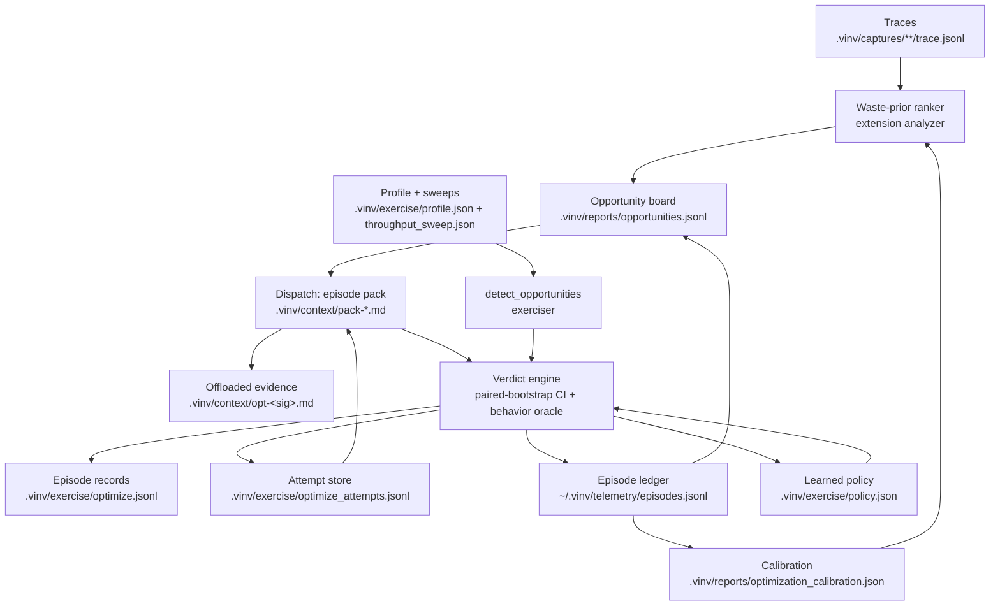

# The optimization ontology — detection → board → dispatch → verdict → learning

This is the concept graph behind Vinv's optimization loop, as it exists on
disk. Every node is a real artifact (paths relative to the target repo unless
marked otherwise), with its writers, readers, and its expiry/compaction rule —
every rule is **relative** (session counts, trace-derived bands, learned
policy), never a wall clock or an absolute threshold. An agent can walk this
document against any repo and answer, at each step, "what should I optimize,
and what already happened before?".

## 1. Detection — two rankers, one doctrine (relative to the trace)

**Extension analyzer** (`computeOptimizationCandidates`): reads the capture
traces (`.vinv/captures/**/trace.jsonl`) as per-session symbol timings,
argument-hash duplication, and per-request span forests, and ranks symbols by
*recoverable* time — `total_ms × waste_prior` — under five waste kinds:
`cache`, `fanout`, `per-call`, `n-plus-1`, `serial-async`. Every signal is
relative to this trace (outliers vs the trace's own medians, amplification vs
the busiest caller); predictions are deflated by the learned calibration (§6)
at ranking time. The `wait` signal (tracelens `blocked_ms = wall − cpu`) rides
the spans as evidence; `gc-pressure` has no dedicated detector yet and
surfaces through per-call/memory evidence.

**Exerciser** (`detect_opportunities` in `exerciser/optimize.py`): reads the
behavioral profile (`.vinv/exercise/profile.json`) and flags `latency-p95`
endpoints (leave-one-out outlier vs the service's other endpoints, factor from
the learned policy `optimize.outlier_factor`) and `throughput-ceiling` (a USL
fit over `.vinv/exercise/throughput_sweep.json` — written by the
`throughput-sweep` CLI — with a real, in-range knee and an R² above the
`optimize.usl_min_r2` policy gate).

## 2. Board — `.vinv/reports/opportunities.jsonl`

The shared blackboard every extension surface posts to and dispatch consumes.
*Writers:* the capture watcher, the hotspot/cache sweeps, panel clicks, and
the MCP `opportunities` action — all via `syncOpportunityBoard`, all deriving
candidates from the ONE ranker above. *Readers:* dispatch (only `posted`
entries are dispatchable), the MCP surface, and this walk. Append-only,
newest-status-wins per id; id = content signature (kind + file + name +
number-stripped evidence class), so re-measured numbers never mint duplicates.
Lifecycle per entry: `posted → dispatched → resolved` (from
`optimization_outcome` ledger events) or `→ expired`. *Expiry:* signature
absent from fresh evidence for 3 consecutive **new capture sessions** (the
same "3 points make a trend" floor the memory-trend detector uses).
*Compaction:* rewritten to one line per id when the file exceeds 4 lines per
live entry.

## 3. Dispatch — `.vinv/context/pack-*.md` + `.vinv/context/opt-<sig>.md`

An accepted plan (sweep or panel) marks its board ids `dispatched` and
composes a context pack for the coding harness. The pack **references, never
inlines**, the heavy evidence: the candidate's span proof and the persisted
attempt history are written ONCE per opportunity signature to
`.vinv/context/opt-<signature>.md` (offload), and the pack body links that
path with a one-line summary — the agent reads the file when it needs depth
(reload). *Writers:* the pack composer (`writeContextPack`), refreshed in
place on re-dispatch. *Readers:* the harness agent; the MCP `playbook` action
lists these paths. *Expiry:* the file dies with its attempt-store key (§5) —
one expiry mechanism for both artifacts.

## 4. Verdict — the one engine, `.vinv/exercise/optimize.jsonl`

`runVerifiedOptimization` (extension) and `optimize.py` (exerciser) share one
doctrine and one row shape: freeze the probe request set at dispatch, measure
BEFORE, dispatch, measure AFTER bound to the episode, and judge with (a) the
behavioral oracle — byte/shape-identical replay of the frozen set — and (b) a
paired-bootstrap 95% CI on per-probe medians that must exclude zero and clear
the minimum effect. Attempts form a lineage: behavior breaks revert to origin
immediately; behavior-preserving no-gain steps stay applied; an unaccepted
lineage reverts to origin. Every finished episode appends to
`.vinv/exercise/optimize.jsonl` (both writers, identical shape). *Readers:*
the Findings view, the machine summary, this walk. Append-only, no expiry —
it is the permanent verdict history.

## 5. Attempt memory — `.vinv/exercise/optimize_attempts.jsonl`

The doom-loop guard. *Writer:* the verdict engine persists every attempt
(approach, comparison, verdict, learning) keyed by (row, opportunity
signature); the Optimize panel records "sighting" lines naming which stored
keys the current ranking still contains. *Readers:* a NEW dispatch for the
same key seeds its prompt (and now its offloaded evidence file, §3) with what
was already tried — "try a materially different approach" survives restarts.
*Expiry:* a key unsighted for 3 fresh capture sessions is dropped and the file
is compacted (bounded tail of session lines); the same pass removes the key's
`opt-<signature>.md`.

## 6. Learning — calibration, policy, and the ledger

- `~/.vinv/telemetry/episodes.jsonl` (per-user home, not the repo): the
  episode ledger. The verdict engine appends one `optimization_outcome` event
  per resolved verdict (row, waste_kind, predicted vs measured delta,
  verdict). *Readers:* the board reconcile (resolves dispatched entries), the
  trajectory report, and the policy updater.
- `.vinv/reports/optimization_calibration.json` — *writer:* the episode
  policy updater, which shrinks per-waste-kind |measured|/predicted ratios;
  *reader:* the ranker (§1), which deflates predictions by the learned ratio
  so over-claiming kinds sink. Ranking uses the deflated value; outcome
  events report against the RAW prediction, so calibration never feeds on its
  own output.
- `.vinv/exercise/policy.json` — learned scalars, shared across both sides:
  `optimize.min_effect` (written by the extension engine from the null-split
  noise floor of each episode's BEFORE samples, read by both verdict paths),
  `optimize.outlier_factor`, `optimize.usl_min_r2` (read by the exerciser
  detector). Overwritten in place; no expiry — each write IS the newest
  estimate.

## The walk: "what should I optimize, and what happened before?"

Read in this order — each step narrows the last:

1. `.vinv/reports/opportunities.jsonl` — newest line per id wins. `posted`
   entries, largest `predicted_ms` first, are the answer to "what should I
   optimize". `dispatched`/`resolved` entries are claimed — do not re-dispatch.
2. `.vinv/reports/optimization_calibration.json` — deflate each entry's
   prediction by its kind's `shrunk_ratio` before trusting the ranking.
3. `.vinv/exercise/optimize_attempts.jsonl` — for your target's signature:
   what was already tried and why it failed. Repeating a listed approach is
   the one known way to waste the episode.
4. `.vinv/context/opt-<signature>.md` — the offloaded span proof + attempt
   history for the target, when a pack has been composed for it.
5. `.vinv/exercise/optimize.jsonl` — the verdict history: which episodes
   accepted, which reverted, with their CIs.
6. `.vinv/exercise/policy.json` — the effect size a win must clear
   (`optimize.min_effect`) before you claim it.
7. For `throughput-ceiling` targets: `.vinv/exercise/throughput_sweep.json` —
   the USL fit to beat; re-run the sweep to verify.

The distilled per-kind fix guidance (patterns, traps, verification) ships
with the extension as playbooks — ask the `vinv-index` MCP server:
`vinv_session action="playbook" kind="<kind>"` returns the playbook plus the
live paths above, already filtered to that kind.
