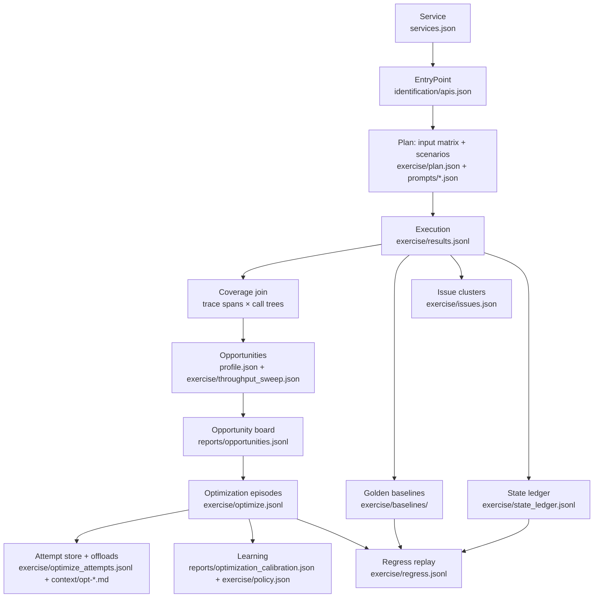

# The testing ontology — what exists, where it lives, and the walk order

This is the concept graph behind Vinv's behavioral testing. Every node is a
real artifact on disk (all paths relative to the target repo's `.vinv/`), so
an agent can WALK this document top-to-bottom against any repo and know, at
each step, what must exist, what produces it, and what "done" means. Nothing
here is endpoint-specific or framework-specific — the same walk applies to
any service Vinv can trace.

## 1. Service — `services.json`, `start_commands/*.json`

What runs. Each service has a verified start command **under tracelens** and a
health probe. *Done =* every service in `services.json` has
`verified: true` and a fresh trace file.
**Known trap:** the traced start command boots the server directly and skips
the repo's own prestart/seed scripts — a reset database silently strips the
seeded credentials. The environment canary (§4) catches this at run start.

## 2. EntryPoint — `identification/apis.json`

Everything invokable: HTTP routes (with handler symbol, file, line), plus
non-HTTP entries — `CLI_*`, `TASK_*`, `CRON_*`, `HOOK_*`, and `MAIN_*`
(scripts with a `__main__` guard; their handler is the function the guard
calls, e.g. `initial_data.py → main()`). `MAIN_*` entries are not "random
functions" — they are the repo's operational scripts (seeding, prestart),
and they matter precisely because §1's trap involves them not running.
*Done =* `identification consolidate` lists every route the OpenAPI schema
knows (reconciled in §3) and each entry builds a call tree.

## 3. Plan — `exercise/plan.json` + `exercise/prompts/<api_id>.json`

The input ontology per endpoint. Three provenance layers, five strategies:

| Strategy | Provenance | What it encodes |
|---|---|---|
| `schema_valid` | JSON schema | 3 seeded valid instances (unique-constraint safe) |
| `schema_boundary` | JSON schema | min/max lengths, zeros, empties, unicode edges |
| `schema_negative` | JSON schema | wrong types, missing required, oversized payloads |
| `observed` | runtime traces | real values mined from captured traffic |
| `semantic` | harness/user | multi-step scenarios: setup chains, variable capture (`${token}`), auth permutations, expectations |

Schemas come from the live `/openapi.json` (at the app's configured
`openapi_url` — often `/api/v1/openapi.json`; a 404 at the root path is
normal) reconciled against `apis.json`. Optional `hypothesis-jsonschema`
adds property-based instances. Semantic plans are authored by the harness
via rendered prompts, or by users through the Journey view; both ride
`prompts/<api_id>.json → reply.plans` and are folded into the plan for
**every** endpoint. *Done =* every endpoint has ≥1 input in each schema
class, and every `needs-semantics` endpoint has a non-expired reply.

## 4. Execution — `exercise/results.jsonl` (append-only)

The run loop, in order:
1. **Environment canary** — dry-run each scenario's first setup step; a
   reset/unseeded environment fails loudly here with remediation.
2. **Bandit rounds** — per-endpoint Thompson sampling over the strategies:
   each arm is Beta(α,β); reward = newly covered symbols after the round's
   trace join; stop after N no-improvement rounds or budget exhaustion.
   Posteriors persist to `bandit.json` and warm-start the next run with
   **evidence decayed 50% per run** — memory with a built-in expiry.
3. **Scenarios** — setup chains execute with variable capture; a failed
   setup **expires** the authored reply (fingerprint-bound) so it gets
   re-authored instead of silently replayed forever.
4. **Auth sweep** — every endpoint replayed under each captured credential
   set, creators-before-consumers so freshly minted resource ids feed the
   by-id endpoints in the same sweep. Rows carry `auth: true`.
5. **Teardown** — mutating-2xx creations are unwound through the service's
   own DELETE endpoints; leftovers are acknowledged in the ledger (§7).

*Done =* `endpoints_exercised == total`, canary clean, `scenarios_expired: 0`.

## 5. Verdicts on outputs — baselines, invariants, issues

- **Golden baselines** (`baselines/`): per distinct (endpoint, input) probe —
  status class + response shape hash; newest wins; verdicts are
  degraded/same/improved.
- **Invariants** (`invariants.json`): Daikon-lite properties (support ≥ 5,
  zero counterexamples, Laplace `(s+1)/(n+2)` confidence).
- **Issue clusters** (`issues.json`): 5xx/crash/invariant-violation/scenario-
  setup failures, deduped by signature, dispatched as fix episodes.

## 6. Improvement loop — detection → board → episodes → learning

The full optimization walk has its own ontology document
([optimization-ontology.md](optimization-ontology.md)) with per-node
writers/readers/expiry; these are its artifacts in this walk's order:

- **Detection inputs**: `profile.json` (exerciser behavioral profile —
  `detect_opportunities` flags `latency-p95` endpoints as leave-one-out
  outliers vs the service's own distribution) and
  `exercise/throughput_sweep.json` (USL concurrency-sweep fit, written by the
  `throughput-sweep` CLI — a valid in-range knee becomes a
  `throughput-ceiling` opportunity). The extension's waste-prior ranker
  detects `cache`/`fanout`/`per-call`/`n-plus-1`/`serial-async` directly from
  the capture traces.
- **`reports/opportunities.jsonl`** — the opportunity board every extension
  surface posts to and dispatch consumes. Append-only, newest-status-wins per
  content-signature id; lifecycle `posted → dispatched → resolved | expired`.
  Only `posted` entries dispatch; expiry = signature absent from fresh
  evidence for 3 consecutive new capture sessions; compacted at >4 lines per
  live entry.
- **Episodes**: **improve → verify → revert → learn → retry**, where
  *verify* = (a) the behavior suite replays byte/shape-identical AND (b) the
  paired-bootstrap 95% CI of relative improvement excludes zero and clears
  the learned `optimize.min_effect`. Fail either → auto-revert. A
  faster-but-wrong change reverts no matter the speedup. Every episode lands
  in `exercise/optimize.jsonl` (CIs, suite verdicts, outcome, files changed —
  same row shape from both the exerciser and the extension engine). *Done =*
  each opportunity has an episode ending in `accept` or `revert-and-stop`.
- **`exercise/optimize_attempts.jsonl`** — per-attempt memory keyed by (row,
  opportunity signature): a re-dispatch seeds "what was already tried" into
  the next prompt. Keys unsighted for 3 fresh capture sessions expire and
  compact away.
- **`context/opt-<signature>.md`** — offloaded heavy evidence (span proof +
  attempt history) that episode packs link instead of inlining; written by
  the pack composer, removed by the attempt store's expiry pass (same rule,
  same moment).
- **Learning**: `reports/optimization_calibration.json` (per-waste-kind
  shrunk |measured|/predicted ratio, written by the episode policy updater,
  deflates future rankings) and `exercise/policy.json` (learned scalars:
  `optimize.min_effect` from each episode's measured noise floor,
  `optimize.outlier_factor`, `optimize.usl_min_r2` — read by both verdict
  paths, overwritten in place).

## 7. Drift accounting — `exercise/state_ledger.jsonl`

Every mutating-2xx execution's planted values (append-only, across runs) and
whether teardown unwound them. Consumed by regress: a diff whose replayed
input intersects uncleaned planted values is kind `environment` — the
engine's own residue, not a code regression.

## 8. Regress — `exercise/regress.jsonl` (append-only history)

Every distinct recorded behavior replays as a permanent case. Authed cases
re-capture fresh credentials from the scenario setup chains (tokens never
persist to disk). Diff kinds: `behavior` (status class flip), `contract`
(shape change), `perf` (median-of-5 confirmed latency regression — one cold
replay never fails a build), `environment` (§7). *Done =* zero
behavior/contract diffs; perf diffs triaged; environment diffs re-golden on
the next run.

## 9. Surfaces — human and machine

- **Journey** (`vinv.journey` / `reports/journey.json`): walk every service
  and endpoint — call tree, flamegraph, exercised IO, add-your-own inputs.
- **Findings** (`vinv.findings` / `reports/findings.json`): issues,
  episodes with CI evidence, regress kinds, latency profile, ledger. The
  backing JSON **is** the machine summary (schema-versioned).

## Agent walk checklist

For any repo: verify §1 services traced → §2 every entry point resolves a
call tree → §3 every endpoint has a full input matrix and live semantic
replies → §4 run to full exercise with clean canary → §5 baselines and
invariants recorded, issues dispatched → §6 the board holds no stale
`posted` entries and every opportunity has a decided episode (walk order in
[optimization-ontology.md](optimization-ontology.md)) → §7 ledger cleaned or
acknowledged → §8 regress green → §9 both surfaces render. Any step that cannot complete must leave a loud artifact
(expired reply, canary failure, issue cluster) — silence is a bug.
