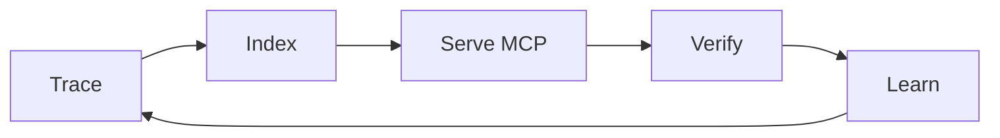

<div align="center">

[](https://open-vsx.org/extension/VinvAI/VinvAI)
[](https://vinv.ai)
[](https://github.com/VinvAI/VinvAI#privacy)
[](https://github.com/VinvAI/VinvAI/blob/HEAD/LICENSE)
[](https://github.com/VinvAI/VinvAI)
[](mailto:support@vinv.ai)
[](https://vinv.ai)

# VinvAI

**Tools for AI agents to test, fix and optimise your codebase.**

Vinv connects runtime traces to the exact source that produced them, hands that evidence to the coding agent you already use, then re-runs the code to prove the fix actually works. **It's not another coding agent — it's the evidence layer under the one you already use:** your agent proposes, Vinv verifies.

<br>

<table width="100%">
<tr>
<td align="center" valign="top" width="55%" nowrap>

<b>Editor extension</b><br><sub>one click — install in</sub>

<a href="https://vscode.dev/redirect?url=vscode%3Aextension%2FVinvAI.VinvAI"></a>
<a href="https://vinv.ai/#install"></a>
<a href="https://vinv.ai/#install"></a>
<a href="https://vinv.ai/"></a>

</td>
<td align="center" valign="top" width="43%" nowrap>

<b>MCP server</b><br><sub>16 tools — add to</sub>

<a href="https://cursor.com/install-mcp?name=vinv&config=eyJ0eXBlIjoic3RkaW8iLCJjb21tYW5kIjoibnB4IiwiYXJncyI6WyIteSIsInZpbnYtbWNwIl19"></a>
<a href="https://vscode.dev/redirect/mcp/install?name=vinv&config=%7B%22type%22%3A%22stdio%22%2C%22command%22%3A%22npx%22%2C%22args%22%3A%5B%22-y%22%2C%22vinv-mcp%22%5D%7D"></a>
<a href="#mcp-server-any-agent"></a>

</td>
</tr>
</table>

<br>

[**See it in action**](https://vinv.ai/#catches) · [**What it does**](https://vinv.ai/#what-it-does) · [**Under the hood**](https://vinv.ai/#under-the-hood) · [**2-min demo**](https://www.youtube.com/watch?v=EkUjPWKHAvI)

<br>


<sub>One workspace context, built once — every agent reads the same <code>.vinv/</code> store.</sub>

</div>

---

## Why Vinv

84% of developers now use or plan to use AI coding tools — but more of them **distrust** the output (46%) than trust it (33%), and distrust nearly doubled in a year ([Stack Overflow 2025, 49k developers](https://survey.stackoverflow.co/2025/ai/)).

The reason is familiar: the agent edits the wrong handler, invents return shapes, then grades its own homework while the server won't even start. Or it loops — test fails, agent edits the same function, test fails again — burning your context window on "let me verify."

Both failures share one root cause: **the agent has never watched your code run.** It argues from static text.

The industry automated *writing* code and left *proving* it entirely manual. Vinv automates the proving — and only then the finding and the fixing.

## Install

Vinv works three ways — an editor extension, a CLI, or an MCP server for any agent. All three share the same local engines.

### Editor extension

One click — [**install from vinv.ai**](https://vinv.ai/#install), which opens the
extension directly in your editor (VS Code, Cursor, Windsurf, VSCodium, Trae and
Insiders). The listing lives on
[Open VSX](https://open-vsx.org/extension/VinvAI/VinvAI) and the
[VS Code Marketplace](https://marketplace.visualstudio.com/items?itemName=VinvAI.VinvAI).

Or from your editor's CLI:

| Editor | Command |
|---|---|
| VS Code | `code --install-extension VinvAI.VinvAI` |
| Cursor | `cursor --install-extension VinvAI.VinvAI` |
| Windsurf | `windsurf --install-extension VinvAI.VinvAI` |
| VSCodium | `codium --install-extension VinvAI.VinvAI` |
| Trae | `trae --install-extension VinvAI.VinvAI` |
| VS Code Insiders | `code-insiders --install-extension VinvAI.VinvAI` |

<sub>First run builds the engines — about 3 minutes, mostly compiling the Rust index; it also fetches a one-time ~100 MB local embedding model ([uv](https://docs.astral.sh/uv/) and [Rust](https://rustup.rs) required). First trace lands about a minute after that; everything after is seconds.</sub>

### CLI (Python engines)

```bash
pip install vinv          # every engine as a console script
# or run one with zero install:
uvx --from vinv exerciser campaign <repo> --budget 20
```

### MCP server (any agent)

Give Claude Code, Cursor, or any MCP client Vinv's tools — **one global config** that finds your open workspace automatically via MCP roots.

Claude Code, Codex, Gemini CLI — installed once for every folder you open, not
just the current one:

```bash
claude mcp add --scope user vinv -- npx -y vinv-mcp
```

```bash
codex mcp add vinv -- npx -y vinv-mcp
```

```bash
gemini mcp add --scope user vinv npx -- -y vinv-mcp
```

<sub>Claude Code defaults to the current directory and Gemini CLI to the current project, so both take <code>--scope user</code>; Codex always writes to <code>~/.codex/config.toml</code> and has no scope flag.</sub>

<sub>Other clients: add <code>{ "command": "npx", "args": ["-y", "vinv-mcp"] }</code> under <code>mcpServers.vinv</code>. See <a href="https://www.npmjs.com/package/vinv-mcp"><code>vinv-mcp</code></a> — 16 tools: semantic search, dead code, fault localization, runtime values/slices/coverage, and the verify/optimize loop.</sub>

<details><summary><b>Build from source</b> — for contributors</summary>

<br>

```bash
git clone https://github.com/VinvAI/VinvAI ~/.vinv/engines && cd ~/.vinv/engines && ./install.sh
```

Windows (PowerShell):

```powershell
git clone https://github.com/VinvAI/VinvAI $HOME\.vinv\engines; cd $HOME\.vinv\engines; .\install.ps1
```
</details>

## The loop, in one picture

**Run → Test → Find → Prove.** Point Vinv at a Python repo; it does the rest — no code changes, no API keys.

<div align="center">

</div>



- **Run** — brings every service up under tracing with zero edits, capturing timings, arguments, return values and call trees from the real run.
- **Test** — drives real requests through every endpoint (valid, boundary, negative, authenticated) and banks each response as a regression case.
- **Find** — surfaces what actually broke or slowed down — server errors, crashes, latency hotspots, dead code — each tied to the exact source line.
- **Prove** — hands the evidence to the agent you already use, then verifies its fix against acceptance tests written *before* the fix that it never sees. A "faster" change that alters any output is auto-reverted.

<sub>Your agent is the only LLM — no new bill, no model picker, no provider keys. See the full walkthrough on <a href="https://vinv.ai/#under-the-hood">vinv.ai/#under-the-hood</a>.</sub>

## See it in action

Not a lab benchmark — real findings, filed on real projects (scikit-learn, watermarks-remover, semantica, FastAPI, Typer, smolagents), every one with an upstream thread you can open. All of it driven by **Cursor running Composer 2.5 with Vinv installed** — not a frontier model. **The evidence did the work, not the model.** The full set with screenshots: [**vinv.ai/#catches**](https://vinv.ai/#catches).

### Dead code — proven by what never ran

Static tools only prove *"nothing references this."* Vinv proves *"no capture ever executed this,"* carries each untraced island with the live callers that still point at it, and lets your agent return the verdict — integrate, delete, or keep.

| Upstream | What Vinv caught | Status |
|---|---|---|
| [**scikit-learn#34790**](https://github.com/scikit-learn/scikit-learn/pull/34790) | Unused `_find_smallest_angle` helper in `_ridge.py`, stranded after a refactor | ✅ **merged** — *"thanks for the clean-up"* |
| [**semantica#1176**](https://github.com/semantica-agi/semantica/pull/1176) | 13 unreferenced symbols across 9 files (289 deletions, 0 insertions) | ✅ **merged** — review restored 2 as deprecated |
| [**fastapi/typer#1937**](https://github.com/fastapi/typer/discussions/1937) | Unused `OptionHelpExtra` TypedDict in the vendored Click | ✅ maintainer-confirmed |

<sub>semantica#1176 is the discipline in one thread: a maintainer flagged two symbols as importable downstream, Vinv restored them with deprecation warnings, and the same maintainer merged.</sub>

### Optimization — a speedup that has to prove itself

Every call is timed and charged to the symbol that spent it. A candidate fix ships only if a **paired-bootstrap 95% CI** clears zero *and* the behavior suite replays **byte-identical** — faster-but-different is auto-reverted.

| Upstream | What Vinv proved | Status |
|---|---|---|
| [**watermarks-remover#261**](https://github.com/guillaumemeyer/watermarks-remover/pull/261) | Skip a discarded `exiftool` subprocess and redundant SynthID scoring in `clean_image` — output identical, regression-tested | ✅ **merged** |
| [**smolagents#2572**](https://github.com/huggingface/smolagents/pull/2572) | Fast-path in `sanitize_for_rich`: **36.27 KB → 0.00 KB/call (~37,137× less)**, regression-tested over 2,014 inputs | 🔵 open, under review |
| [**semantica#1178**](https://github.com/semantica-agi/semantica/pull/1178) | Build the built-in algorithm catalog once, share it copy-on-write | 🔵 open, triaged |

### Bug report — bugs that only exist while something runs

Scanners read source and guess. Vinv drives the service and watches what comes back:

- **drive** — every discovered endpoint, exercised with inputs nobody wrote.
- **judge** — a 500 is not a finding on its own; the oracle names the status that *should* have come back.
- **hand over** — ships as an evidence pack: repro command, caller chain, real argument values.

On [fastapi/full-stack-fastapi-template](https://github.com/fastapi/full-stack-fastapi-template) (~44k★), the authenticated sweep filed [**discussion #2454**](https://github.com/fastapi/full-stack-fastapi-template/discussions/2454) — four endpoints answering 500 to input that should be 4xx, one repro each — then another contributor reproduced all four against `master`, file-and-line: *"checked against master — they're all real."*

## What Vinv gives your agent

One loop, grouped by what you came to fix. Each capability links to a live walkthrough on the site.

**Understand the codebase** → [vinv.ai/#what-it-does](https://vinv.ai/#what-it-does)
- **Semantic code search** — ask by meaning, get ranked symbols with `def` bodies and line numbers, embedded by a local model.
- **Code Graph** — a persistent map of every symbol and call edge, updated incrementally on save, with a live runtime overlay.
- **Runtime tracing** — zero-edit tracing: timing, memory, args, returns, errors, per call, joined to source.
- **Ask Vinv** — plain-English questions about your running system, every answer citing the exact trace spans and source lines, with a deterministic critic that blocks any claim the evidence can't back.

**Find what actually broke** → [vinv.ai/#catches](https://vinv.ai/#catches)
- **Rank suspects** — on any failure, symbols ranked by fault-localization score over real pass/fail requests, with the real error messages attached.
- **Behavior exerciser** — Vinv doesn't wait for traffic: it drives every discovered endpoint itself, picks strategies with a Thompson-sampling bandit, and banks every response as a permanent regression case.

**Clean up dead code** → [vinv.ai/#what-it-does](https://vinv.ai/#what-it-does)
- **Dead-code sections** — untraced *islands* split into "no references" vs "reached from live code but never taken," each with the live callers that still point at it and a keep-or-cut verdict with reasoning.

**Recover latency** → [vinv.ai/#what-it-does](https://vinv.ai/#what-it-does)
- **Recoverable time** — latency hotspots ranked by the milliseconds you'd actually get back, each dispatched as a predicted-then-proven optimization instead of a guess.

**Trust the fix** → [vinv.ai/#under-the-hood](https://vinv.ai/#under-the-hood)
- **Verified fixes** — replayed start, live port, acceptance tests the agent never sees. One click reverts everything an episode touched.
- **Journey** — one walkthrough of everything verified: every service, then every endpoint's call tree, latency flamegraph, and exact inputs → outputs, with a form to add your own test inputs that the engine replays forever.
- **Auto-Pilot** — one click drives discover → set up → trace → exercise → fix → verify, until green or budget; when new trace errors land, the fix episode is already dispatched by the time you see the red ring in the graph.
- **Findings** — issue clusters, optimization episodes with paired-bootstrap confidence intervals, regression diffs by kind, and a machine-readable `findings.json` your agent can consume directly.

> **Honest scope:** Python first — **services and APIs**. Other languages get the index, graph and grounded Q&A, but no runtime evidence yet. TypeScript and Go are next.

## Agent alone vs Agent + Vinv

| | Agent alone | Agent + Vinv |
|---|---|---|
| Finding code | greps and guesses files | ranked symbols with line numbers, by meaning |
| "Done" | claims it, grades its own homework | replayed start, live port, unseen acceptance tests |
| Memory | forgets every session | persistent index + graph, updated on save |
| Runtime | can't see it | real traces, values, flamegraphs per call |
| Debugging | reads source, speculates | fault-ranked suspects with real error messages |
| Dead code | can't tell used from unused | never-executed islands with live callers and a verdict |
| Bad fix | you diff and pray | one-click revert of everything the episode touched |
| API testing | writes tests it then grades itself | exercises every endpoint, banks each response as an unseen regression case |
| Perf claims | "should be faster now" | paired-bootstrap 95% CI must exclude zero, behavior byte-identical, or auto-revert |
| Cost | burns tokens re-exploring | evidence pack composed once, locally; the bandit learns which composition pays |

## Why agents can't reward-hack under Vinv

Vinv ties **every runtime trace to the exact code that produced it** and hands your agent a context graph built from that join — so the agent argues from evidence, not vibes. And when it claims victory, Vinv doesn't take its word:

- **Acceptance tests are authored *before* the fix**, stored outside the workspace under an opaque token, and must fail deterministically twice on the broken code — a test that passes pre-fix is thrown away.
- **A "faster" fix that changes any observable output is auto-reverted** — the behavior suite must replay byte-identical and the speedup's paired-bootstrap 95% CI must exclude zero.
- **Deliberate 4xx rejections aren't "errors" to fix** — the defect classifier knows a service saying *no* correctly from a service breaking, so the agent is never handed a fake goal it can only game.
- **When two attempts stop making progress**, a Nash-bargaining stall judge continues only if both an explorer stance *and* an auditor stance strictly prefer it to asking you.

<details><summary><b>Under the hood: the oracle roster, the budget dispatcher, and the sandbox</b></summary>

<br>

The **Test** stage isn't one tester — it's a set of oracles, each hunting a different class of defect, all writing into the same findings and fix-dispatch path.

| Oracle | What it finds | Finding kinds |
|---|---|---|
| **HTTP exerciser** | Drives every endpoint itself — schema-valid, boundary, negative, values mined from real traces, multi-step auth | `server-error` · `crash` · `invariant-violation` |
| **Differential oracle** | Compares a handler or evaluator against a reference — for a parser, CPython itself; disagreement *is* the bug report | `differential-mismatch` |
| **Fault injection** | Adversarial-but-**legal** shapes at a dependency boundary, plus every chunk-split point on a stream | `fault-crash` · `fault-divergence` |
| **Concurrency oracle** | Deterministic interleavings and timeout injection — shared state that corrupts under parallel calls, lock orderings that deadlock | `concurrency-divergence` · `concurrency-hang` |
| **Environment oracle** | A dependency-resolution matrix, and upstream symbols whose signature moved under you | `signature-drift` |
| **Golden I/O baselines** | A "faster" change that quietly dropped a field or changed a status class | `baseline-degraded` |
| **Dead code** | Untraced islands with the live callers that still reference them | dead sections |
| **Runtime analysis** | Latency hotspots, memory-leak suspects (Theil–Sen), duplicate recomputation worth caching, throughput ceiling (USL fit) | hotspots · leaks · cache candidates · `throughput-ceiling` |

**The dispatcher is a bandit.** `exerciser campaign` allocates **one budget** across every *armed* oracle by Thompson sampling over `(target × technique × oracle)`. Cost is *measured* (wall-clock normalized to probe-equivalents plus subprocesses spawned), and credit is paid **once per defect signature** so a deterministic oracle can't re-earn credit for the same bug. Posteriors persist in `campaign.json` — which technique pays *on your repo* is learned.

Unverified code runs behind a **containment ladder**: a kernel-enforced OS sandbox (`sandbox-exec` / `bwrap` / `unshare`) where the host offers one, otherwise a process shim — always with a disposable repo copy, redirected `HOME`/`TMPDIR`, blocked network and subprocess spawning. The tier is decided by a *probe* that verifies a write outside the root really failed, never by a binary being on `PATH`. Postgres, Redis and S3 are substituted *inside* the jail so code that needs them runs instead of failing to connect.

</details>

## Proven on itself

Vinv's release gate is Vinv — these numbers come from running the loop on this repository:

| Metric | Result |
|---|---|
| Index | 4,036 symbols |
| Search | file hit@10 **0.90** · symbol MRR 0.51 · p50 81ms |
| Crash recovery | indexer, embedder, and traced service all kill-tested mid-run |
| Self-found waste | 83% duplicate compute found → now cached |
| Retrieval tuning | off-policy evaluation (doubly-robust, BCa bootstrap) over 800 logged decisions promoted **top-k 10** (+0.173, 95% CI [+0.081, +0.317]) and blocked both other candidates |
| Test suite | **2,376 tests** — 1,575 Python · 801 extension |

<sub>The full learning walk — reward, propensity, gating math, with <code>file:line</code> for every claim — is <a href="https://github.com/VinvAI/VinvAI/blob/main/docs/learning.md"><code>docs/learning.md</code></a>. The test ontology is <a href="https://github.com/VinvAI/VinvAI/blob/main/docs/testing-ontology.md"><code>docs/testing-ontology.md</code></a>.</sub>

## Works with your agent

One command (**Register Vinv MCP in Agent Tools**) writes the servers into every agent it detects:

| Agent | Fix dispatch | MCP tools |
|---|:---:|:---:|
| Claude Code | ✅ | ✅ auto |
| Cursor (CLI + chat) | ✅ | ✅ auto |
| Codex CLI | ✅ | ✅ auto |
| Gemini CLI | ✅ | ✅ manual |
| Copilot Chat (VS Code) | ✅ | ✅ auto |
| Windsurf Cascade | ✅ | ✅ auto |

<details><summary><b>Where the config lands, per client — and how to verify</b></summary>

<br>

Registration is idempotent and never commits secrets. The servers (`vinv-index`, `vinv-runtime`, `vinv-exercise`) launch over stdio via the editor's own runtime.

- **Claude Code** — `~/.claude.json`, project-local scope. Verify: `claude mcp list`.
- **Cursor** — `<repo>/.cursor/mcp.json`. Verify: Settings → MCP shows them green.
- **Codex CLI** — `~/.codex/config.toml` under `[mcp_servers.vinv-index]` / `[mcp_servers.vinv-runtime]`.
- **Copilot Chat** — native VS Code MCP provider (auto), `.vscode/mcp.json` on older builds.
- **Windsurf Cascade** — `~/.codeium/windsurf/mcp_config.json`.
- **Gemini CLI** — dispatch works out of the box; for MCP tools, add the same stdio servers to `~/.gemini/settings.json`.

Your agent is also Vinv's only LLM — every analysis step routes through the coding-agent CLI you already pay for.
</details>

<details><summary><b>MCP tools reference</b> — few tool names on purpose; the session tool multiplexes</summary>

<br>

**`vinv-index`** — your code and the session:

| Tool | Returns |
|---|---|
| `vinv_query` | Ranked symbols with paths + a decision id — any by-meaning search, before grep |
| `vinv_feedback` | ack — reward −1..1 after acting on results; trains retrieval |
| `vinv_session` | **10 actions in one tool** — read: trajectory · status · issues · hotspots · memory_trends · cache_candidates; act: `fix` · `run_sweep` · `set_goal` · `set_budget` |

**`vinv-runtime`** — the captured runs (read-only, provenance-stamped):

| Tool | Returns |
|---|---|
| `rank_suspects` | Fault-ranked symbols over pass/fail requests, real errors attached |
| `values_of` | Observed argument/return types, null-rates, ranges |
| `slice` | Observed caller chain from request root, values at each frame |
| `coverage_of` | What ran, how often, ok/error, timing |
| `callers_of` / `blast_radius` / `why_did_this_run` | Observed callers · transitive impact · entry-point paths |

**`vinv-exercise`** — your agent exercises your service and reports the run back; Vinv grades what came back.
</details>

## The engines

`pip install vinv` ships every engine as a console script — or use any one standalone:

| Engine | Command | What it does |
|---|---|---|
| [**exerciser**](https://github.com/VinvAI/VinvAI/blob/main/exerciser/) | `exerciser campaign <repo> --budget N` | **Start here.** Coverage-guided API exerciser + oracle swarm; banks a permanent regression suite and reports which technique paid. |
| [**tracelens**](https://github.com/VinvAI/VinvAI/blob/main/tracelens/) | `tracelens run -- <cmd>` | Zero-edit runtime tracer — timings, arguments, return values, call trees. |
| [**index**](https://github.com/VinvAI/VinvAI/blob/main/index/) | `index query <repo>` · `index deadcode <repo>` | Rust semantic code index — search by meaning, plus a source-only dead-code report. |
| [**identification**](https://github.com/VinvAI/VinvAI/blob/main/identification/) | `identification consolidate <repo>` | Joins traces to source — API surface + call-graph map. |
| [**bringup**](https://github.com/VinvAI/VinvAI/blob/main/bringup/) | `bringup list/start <repo>` | Brings services up under tracing. |
| [**handbook**](https://github.com/VinvAI/VinvAI/blob/main/handbook/) | `handbook generate <repo>` | Renders the codebase-discovery task your agent runs. Prompt-only. |
| [**goal**](https://github.com/VinvAI/VinvAI/blob/main/goal/) | `goal create <context>` | Distills a working context into one standing goal. Prompt-only. |
| [**embedder**](https://github.com/VinvAI/VinvAI/blob/main/embedder/) | `vinv-embedder serve` | Local embedding sidecar ([granite-embedding-small](https://huggingface.co/ibm-granite/granite-embedding-small-english-r2)) — no cloud keys. |
| [**contracts**](https://github.com/VinvAI/VinvAI/blob/main/contracts/) | *(library)* | `lens_contracts` — the shared data contract every engine reads and writes. |

<details><summary><b><code>exerciser</code> CLI — the oracle swarm, runnable standalone</b></summary>

<br>

| Command | What it does |
|---|---|
| `exerciser campaign <repo> [--base-url URL] [--budget N]` | **Start here.** One budget across every armed oracle by Thompson sampling |
| `exerciser plan <repo> [--base-url URL]` | Per-endpoint input plan (schema + observed + semantic layers) |
| `exerciser run <repo> --base-url URL` | Execute the plan against the live traced service, coverage-guided |
| `exerciser functions <repo> [--require-tier os-sandbox]` | Drive entry points and exported functions in process, contained |
| `exerciser differential <repo> [--target M:f --reference cpython-exec]` | Compare a function against a reference implementation |
| `exerciser faults <repo> [--auto-target M:f]` | Legal-but-adversarial shapes at a dependency boundary |
| `exerciser concurrency <repo> --target M:f` | Deterministic schedules + timeout injection |
| `exerciser environment <repo>` | Dependency-resolution matrix + upstream signature drift |
| `exerciser containment` | Which containment tier *this host* can actually provide, and why |
| `exerciser throughput-sweep <repo> --base-url URL` | Concurrency sweep + USL fit → `throughput-ceiling` opportunities |
| `exerciser regress <repo> --base-url URL` | Replay the accumulated behavior suite, report diffs by kind |
| `exerciser scorecard <repo>` | Per-service scorecard: coverage before→after, invariants, issues, latency |

Requires `identification consolidate` first for `apis.json`, and — for real coverage — a service running under `tracelens`.
</details>

## FAQ

<details><summary><b>Do I need my own API keys?</b></summary>
No. Vinv runs everything locally. The semantic index and code embedder run on your machine without any provider keys. Your agent CLI (Claude Code, Cursor, …) handles its own LLM communication using the auth you already set up.
</details>

<details><summary><b>Is there any telemetry or data collection?</b></summary>
No telemetry, no analytics, no usage pings, no crash reports. Vinv stores per-repo state in <code>.vinv/</code> and per-machine state in <code>~/.vinv/</code>; sensitive data in traces is redacted and never sent anywhere. The extension makes exactly <b>one</b> outbound request of its own: a GET of a static file at <code>notices.vinv.ai</code> on activation, so a broken release can tell you. No query string, no identifiers, nothing uploaded; at most once every 12 hours. Turn it off with <code>vinv.notices.enabled</code>.
</details>

<details><summary><b>Does Vinv modify my code?</b></summary>
No. Vinv uses a zero-edit tracer, instrumenting your Python backend at runtime without SDK integrations, decorators, or source changes.
</details>

<details><summary><b>How does it know if a fix worked?</b></summary>
Acceptance tests are authored before the fix, stored outside your workspace under an opaque token, and required to fail deterministically twice on the broken code — a test that passes pre-fix is discarded. The fix must then pass them, with a replayed start, a live port, and every other observable behavior byte-identical. A deterministic anti-cheat audit over the diff blocks test edits, swallowed exceptions and shadow modules outright.
</details>

<details><summary><b>Which languages and agents are supported?</b></summary>
Runtime evidence — tracing, the oracle swarm, verified fixes — is Python today, for <strong>services and APIs</strong>; other stacks get the semantic index, code graph, and grounded Q&A. TypeScript and Go are next. Editors: VS Code, Cursor, Windsurf, VSCodium, Trae, VS Code Insiders. Agents it drives: Claude Code, Cursor CLI, Codex CLI, Gemini CLI, Copilot Chat, Windsurf Cascade.
</details>

<details><summary><b>Is it really free and open source?</b></summary>
Yes — <a href="https://github.com/VinvAI/VinvAI/blob/main/LICENSE">Apache 2.0</a>, every engine builds from source in this repo.
</details>

## Privacy

- **Everything on your machine** — per-repo state in `.vinv/` (auto-gitignored), per-machine in `~/.vinv/`. No account, no API keys, **no telemetry — none.**
- **One outbound request, and you can read it**: a GET of a static JSON file at `notices.vinv.ai` on activation, for broken-release and security notices only. No query string, no identifiers, nothing uploaded; at most once per 12 hours; disable with `vinv.notices.enabled`.
- The only download is the embedding model (Hugging Face, once, ~100 MB); everything else builds from this repo.
- Traces store bounded **summaries**, not raw values; sensitive parameter names (`password`, `token`, `api_key`, …) are redacted, never captured.
- The only LLM Vinv talks to is the coding-agent CLI **you** configured, through its own auth.

## Contributing & license

See [CONTRIBUTING.md](https://github.com/VinvAI/VinvAI/blob/main/CONTRIBUTING.md) — `uv sync`, `cargo build` in `index/`, `npm install && npm run check` in `extension/`, keep `tests/e2e/planted_bug_golden/run.py` green. Good first issues are labeled. By taking part you agree to our [Code of Conduct](https://github.com/VinvAI/VinvAI/blob/main/CODE_OF_CONDUCT.md); to report a vulnerability, see [SECURITY.md](https://github.com/VinvAI/VinvAI/blob/main/SECURITY.md). [Apache License 2.0](https://github.com/VinvAI/VinvAI/blob/main/LICENSE) © 2026 VinvAI.

<div align="center">

**Your agent says it's done. Vinv says prove it.**

<sub>If Vinv caught something your agent missed — <a href="https://open-vsx.org/extension/VinvAI/VinvAI/reviews">leave a review on Open VSX</a> and ⭐ star this repo.</sub>

<sub><a href="https://vinv.ai">vinv.ai</a> · <a href="https://vinv.ai/#catches">What it catches</a> · <a href="https://open-vsx.org/extension/VinvAI/VinvAI">Open VSX</a> · <a href="https://www.linkedin.com/company/vinvai/">LinkedIn</a> · <a href="mailto:support@vinv.ai">support@vinv.ai</a></sub>
</div>
